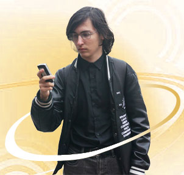
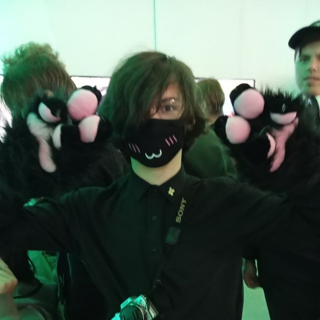

# King-of-the-all-Cookies</img>

  

Hi! I'm the King-of-the-all-Cookies. I'm a hacker, game translator, composer, a bit of an artist, and just a good person. I develop my own software for translating games.

Well, I'm also a reverse engineer (how could that be so obvious, right?), and I'm currently developing my own game engine. And yes, that's completely unrelated.

# Roman Sergienko</img>

I participate (and have participated) in many projects. These include: my own <a href="filldor.ru">translation agency "Phoenix & Co."</a>, my profile picture on the <a href="https://mrim.su">mrim.su</a> website, I'm involved in translating Ace Attorney into Russian, I'm also a back-end developer on Lunastore (an app store for Windows XP), a composer at <a href="https://t.me/TOST_Undertale_Orange">TOST!UTOrange</a>, I help the "Людские переводы" team, I participated in the translation of DELTARUNE (from <a href="https://t.me/LazyDesman">LazyDesman</a>), I'm a member of the Daniel Myslivets team, and much more. I'm always open to communication. You can find my contact information on my <a href="https://kotac.ru">website</a> (assuming the virtual machine works with it, of course. If it doesn't, blame Microsoft, lmao).

# Me in IRL</img>

  

