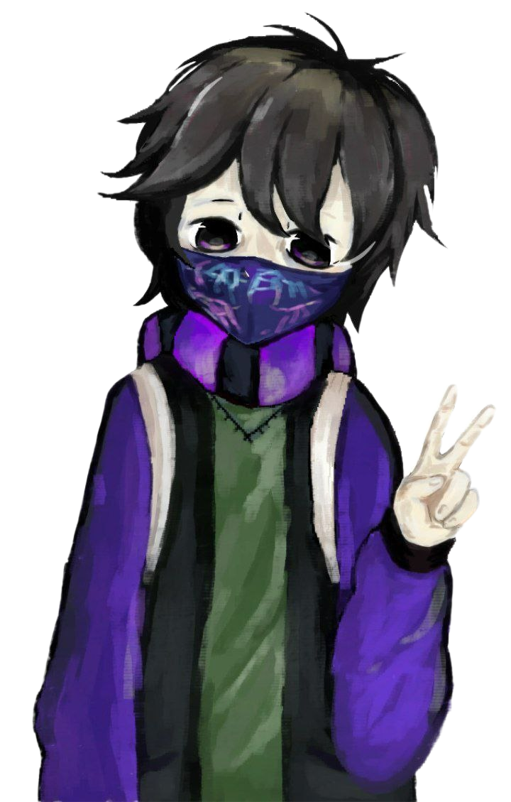

# King-of-the-all-Cookies

  

Hi! I am the King-of-the-all-Cookies. Hacker, game translator, composer, and just a good person. I am developing my own game translation software.

Well, I'm also a reverse engineer (how is it not obvious, right?) and right now I'm developing my own game engine. And yes, it has nothing to do with it.

  

